# chmonitor Dashboard

[](https://github.com/chmonitor/chmonitor/actions/workflows/ci.yml)
[](https://duyet.github.io/uptime/history/clickhouse-monitoring-vercel-app)
[](https://github.com/chmonitor/chmonitor/releases)
[](https://github.com/chmonitor/chmonitor/pkgs/container/chmonitor)
[](LICENSE)

A modern dashboard (TanStack Start, as of **v0.3**) that provides real-time insights into ClickHouse clusters through system tables. Every page is pre-rendered at build time with client-side data fetching for optimal performance and CDN caching.

> **Upgrading from v0.2?** v0.3 rebuilds the app on TanStack Start. ClickHouse
> connection vars are unchanged; browser vars move from `NEXT_PUBLIC_*` to
> `VITE_*` (old names still work as a fallback). See
> **[Upgrading to v0.3](#upgrading-to-v03)** below or the full
> [Migrate to v0.3](https://docs.chmonitor.dev/migrating/v0-3) guide.

<p align="center">
  <strong>Live:</strong> <a href="https://dash.chmonitor.dev/?ref=github">dash.chmonitor.dev</a> | <a href="https://chmonitor.dev/?ref=github">chmonitor.dev</a> | <a href="#screenshots">Screenshots</a>
</p>

**Features:**

- **Query Monitoring**: Running queries, query history, resources (memory, parts read, file_open), expensive queries, slow queries, failed queries, query profiler
- **Cluster Overview**: Memory/CPU usage, distributed queue, global settings, MergeTree settings, metrics, asynchronous metrics
- **Data Explorer**: Interactive database tree browser with fast tab switching and column-level details, projections, dictionaries
- **Table Analytics**: Size, row count, compression, part sizes with column-level granularity, detached parts, readonly tables, view refreshes
- **Visualization**: 30+ metric charts for queries, resources, merges, performance, and system health
- **Merge & Replication**: Merge operations, merge performance, replication queue, replicas
- **Security & Access**: Users, roles, security settings
- **Developer Tools**: Zookeeper explorer, query EXPLAIN, query kill, distributed DDL queue, mutations
- **Multi-Host Support**: Monitor multiple ClickHouse instances from a single dashboard
- **AI Agent**: Built-in AI chat for natural language queries against your ClickHouse cluster
- **MCP Server**: Model Context Protocol endpoint for AI tool integration (Claude, Cursor, etc.)
- **Rust CLI**: Standalone terminal and TUI monitoring tool


## Quick start

One container, pointed at any reachable ClickHouse (OSS, Altinity, or ClickHouse Cloud):

```bash
docker run -d --name chmonitor -p 3000:3000 \
  -e CLICKHOUSE_HOST=https://clickhouse.example.com:8443 \
  -e CLICKHOUSE_USER=default \
  -e CLICKHOUSE_PASSWORD=change-me \
  ghcr.io/chmonitor/chmonitor:latest
```

Open **<http://localhost:3000>**. Pin a release tag instead of `latest` for production.

> Just want to look first? The live demo is at **[dash.chmonitor.dev](https://dash.chmonitor.dev/?ref=github)** — no setup required.
> Other targets (Cloudflare Workers, one-click Railway/Render/Fly, Kubernetes) are under [Deployment](#deployment).

## Deployment

chmonitor is **self-hosted** — run it next to your ClickHouse with the same
`CLICKHOUSE_*` connection vars on any of these targets:

- **[Docker](#docker)** — one `docker run`; the fastest path to a live dashboard.
- **[Cloudflare Workers](#cloudflare-workers)** — global edge deploy (how the
  demo at [dash.chmonitor.dev](https://dash.chmonitor.dev/?ref=github) runs).
- **[One-click templates](docs/content/deploy/one-click.mdx)** — Railway, Render, Fly.io.
- **[Kubernetes (Helm)](https://docs.chmonitor.dev/deploy/k8s)** — for clusters.

Prefer to look before you install? Try the live demo above — no setup required.

### Cloudflare Workers

This project supports deployment to Cloudflare Workers with static site generation and API routes.

**Prerequisites:**
- Node.js 18+ and Bun
- Cloudflare Workers account
- Wrangler CLI: `npm install -g wrangler`

**Setup:**

1. Clone and install dependencies:
```bash
git clone https://github.com/chmonitor/chmonitor.git
cd clickhouse-monitoring
bun install
```

2. Configure environment variables in `.env.local`:
```bash
CLICKHOUSE_HOST=https://your-clickhouse-host.com
CLICKHOUSE_USER=default
CLICKHOUSE_PASSWORD=yourpassword
CLICKHOUSE_TZ=UTC
```

Optional API-key protection for `/api/v1/*` routes:

```bash
CHM_API_KEY_SECRET=your-signing-secret
```

Optional Clerk UI/session support (set at build time; `NEXT_PUBLIC_*` is the v0.2 fallback):

```bash
CHM_AUTH_PROVIDER=clerk
VITE_AUTH_PROVIDER=clerk
VITE_CLERK_PUBLISHABLE_KEY=pk_live_your_key
CLERK_SECRET_KEY=sk_live_your_key
```

Feature permissions default to enabled and public. Add sparse overrides when a
deployment should hide or protect a feature:

```toml
# /etc/clickhouse-monitor/config.toml
[features.agent]
access = "authenticated"

[features.metrics]
enabled = false
```

`access = "guest"` is accepted as an alias for `access = "public"`.

```bash
CHM_CONFIG_FILE=/etc/clickhouse-monitor/config.toml
# or env-only:
CHM_FEATURE_AGENT_ACCESS=authenticated
CHM_DISABLED_FEATURES=settings,metrics
```

Leave auth provider env unset or set it to `none` for self-hosted deployments
without auth.

3. Deploy to Cloudflare Workers:
```bash
# Set CLOUDFLARE_API_TOKEN in .env.prod or export it
# OR use OAuth: npx wrangler login

# Unified deploy (config, build, deploy, cache — same as CI)
bun run cf:deploy
```

**Manual Deployment Steps:**
```bash
# Step by step (same as CI)
bun run cf:config        # Set secrets from .env.prod
cd apps/dashboard
bun run build            # Vite build → native Workers bundle (+ tsc --noEmit)
wrangler deploy --minify
```

**Important Notes:**
- Built with **Vite** + `@cloudflare/vite-plugin` into a **native Workers bundle** — no OpenNext, no KV/R2/D1 cache-population step
- **TanStack Start** + React 19 (the v0.2 Next.js app was retired in v0.3)
- Static shell is pre-rendered at build time; data is fetched client-side for edge CDN caching
- API routes run on Workers using the Fetch API
- Supports multi-host monitoring with query parameter routing (`?host=0`)

### Docker

```bash
docker run -d \
  -p 3000:3000 \
  -e CLICKHOUSE_HOST=https://your-clickhouse-host.com \
  -e CLICKHOUSE_USER=default \
  -e CLICKHOUSE_PASSWORD=yourpassword \
  ghcr.io/chmonitor/chmonitor:latest
```

### Releases

Tagged releases are built by GitHub Actions from tags matching `v*`. The release page includes:

- Docker images published to `ghcr.io/chmonitor/chmonitor` with the release version tag
- a Node.js standalone archive (`*-standalone.tar.gz`, the Nitro node-server output) for self-hosted Node deployments
- a Cloudflare Workers archive (`*-cloudflare.tar.gz`) for manual inspection or deployment
- generated release notes with CLI command usage, Docker tags, deployment steps, and checksums

For repeatable Docker deploys, prefer the versioned image tag from the release page instead of `latest`.

## Upgrading to v0.3

v0.3 rebuilds the dashboard on **TanStack Start**. Features, routes, and
ClickHouse setup carry over unchanged. The only env change is the browser
variable prefix, and the old names keep working:

| Concern | v0.2 (Next.js) | v0.3 (TanStack Start) |
|---|---|---|
| Browser var prefix | `NEXT_PUBLIC_*` | `VITE_*` _(old names still work)_ |
| Auth provider (client) | `NEXT_PUBLIC_AUTH_PROVIDER` | `VITE_AUTH_PROVIDER` |
| Clerk key (client) | `NEXT_PUBLIC_CLERK_PUBLISHABLE_KEY` | `VITE_CLERK_PUBLISHABLE_KEY` |
| Auth provider (server) | derived from client var | `CHM_AUTH_PROVIDER` (`none\|clerk\|proxy`) |
| Docker entrypoint | `node server.js` | `node server/index.mjs` |
| ClickHouse vars | `CLICKHOUSE_HOST/USER/PASSWORD/NAME` | **unchanged** |

`VITE_*` vars are **build-time inlined** — set them when building the image/Worker,
not only at runtime. Full per-platform steps:
[Migrate to v0.3](https://docs.chmonitor.dev/migrating/v0-3).

### Migrate your config with an AI assistant

Paste your current configuration (`.env`, `docker-compose.yml`, Helm
`values.yaml`, or a k8s manifest) into any AI assistant with the prompt below.
It applies the v0.3 rename rules and returns the migrated config plus a summary
of what changed. This same prompt ships in every breaking-change GitHub Release
and is kept in sync from [`.github/release-migration-prompt.md`](.github/release-migration-prompt.md).

```text
You are migrating a chmonitor deployment from v0.2 (Next.js) to v0.3 (TanStack Start).
Here is my current environment (.env / docker-compose / wrangler / k8s manifest):

<PASTE YOUR ENV HERE>

Rewrite it for v0.3 applying EXACTLY these rules, and output the migrated config
plus a short list of what you changed:

1. Rename every client var prefix NEXT_PUBLIC_ -> VITE_. Specifically:
   NEXT_PUBLIC_AUTH_PROVIDER          -> VITE_AUTH_PROVIDER
   NEXT_PUBLIC_CLERK_PUBLISHABLE_KEY  -> VITE_CLERK_PUBLISHABLE_KEY
   NEXT_PUBLIC_FEATURE_CONVERSATION_DB-> VITE_FEATURE_CONVERSATION_DB
   (any other NEXT_PUBLIC_X -> VITE_X). The old names still work as a fallback.
2. Add server-side auth var CHM_AUTH_PROVIDER (none|clerk|proxy) mirroring the
   client provider. It is authoritative on the server; keep VITE_AUTH_PROVIDER too.
3. Do NOT rename server vars: CLICKHOUSE_HOST, CLICKHOUSE_USER, CLICKHOUSE_PASSWORD,
   CLICKHOUSE_NAME, CLICKHOUSE_MAX_EXECUTION_TIME, CLERK_SECRET_KEY, *_API_KEY — keep as-is.
4. VITE_* vars are build-time inlined: ensure they are present at image/Worker BUILD
   time (Docker build-args or CI build env), not only at container runtime.
5. If this is a Docker deployment, change the container start command from
   `node server.js` to `node server/index.mjs`. Port 3000 and the /api/healthz
   healthcheck are unchanged.
6. Flag anything that has no v0.3 equivalent instead of silently dropping it.
```

## Documentation

- **[/docs](/docs)** - Full documentation site (local/docs)
- **llms.txt** - AI agent discovery file for automated code understanding
- https://zread.ai/chmonitor/chmonitor _(AI Generated)_
- https://docs.chmonitor.dev
  - [Getting Started](https://docs.chmonitor.dev/getting-started)
    - [Local Development](https://docs.chmonitor.dev/getting-started/local)
    - [User Role and Profile](https://docs.chmonitor.dev/getting-started/clickhouse-requirements)
    - [Enable System Tables](https://docs.chmonitor.dev/getting-started/clickhouse-enable-system-tables)
  - [Deployments](https://docs.chmonitor.dev/deploy)
    - [Vercel](https://docs.chmonitor.dev/deploy/vercel)
    - [Docker](https://docs.chmonitor.dev/deploy/docker)
    - [Kubernetes Helm Chart](https://docs.chmonitor.dev/deploy/k8s)
    - [One-Click Deploy](docs/content/deploy/one-click.mdx) — Railway / Render / Fly.io community templates
  - [Advanced](https://docs.chmonitor.dev/advanced)
    - [Telemetry](docs/content/advanced/telemetry.mdx) — opt-in, privacy-first usage metrics (off by default)
    - [Editions](docs/content/advanced/editions.mdx) — open-core model: GPL-3.0 community is free forever; enterprise features gated by `CHM_EDITION`
  - [Reference](https://docs.chmonitor.dev/reference)
    - [Platform Support Matrix](docs/content/reference/support-matrix.mdx) — ClickHouse versions and distributions (supported / best-effort / untested)
    - [Connection Presets](docs/content/reference/connection-presets.mdx) — least-privilege read-only user setup for ClickHouse OSS, Altinity, and Cloud
    - [Contributing a config / check](docs/content/reference/catalog-contributing.mdx) — how to add a declarative monitoring check to the catalog
    - [MCP Clients](docs/content/reference/mcp-clients.mdx) — connect Claude Desktop, Cursor, or any MCP client
    - [Grafana Bridge](docs/content/reference/grafana-bridge.mdx) — read chmonitor's ClickHouse from Grafana (community recipe)

### AI Agent Access

**llms.txt** — standardized file that helps AI coding agents discover and understand the codebase structure. Access at `https://your-domain.com/llms.txt` or `/llms.txt` in local development.

**MCP Server** — exposes a Model Context Protocol endpoint at `/api/mcp` for AI tools to query your ClickHouse cluster directly. See [docs/knowledge/mcp-server.md](docs/knowledge/mcp-server.md) for setup.

**Knowledge Graph** — developer-facing notes in `docs/knowledge/` with decisions, conventions, and architecture docs. See [docs/knowledge/README.md](docs/knowledge/README.md) for the index.

## Screenshots

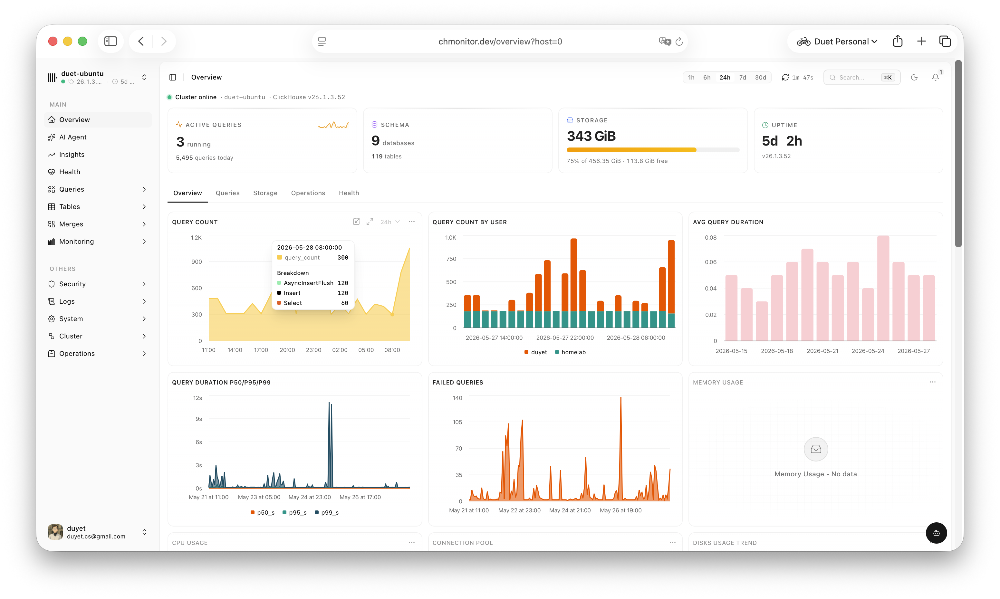
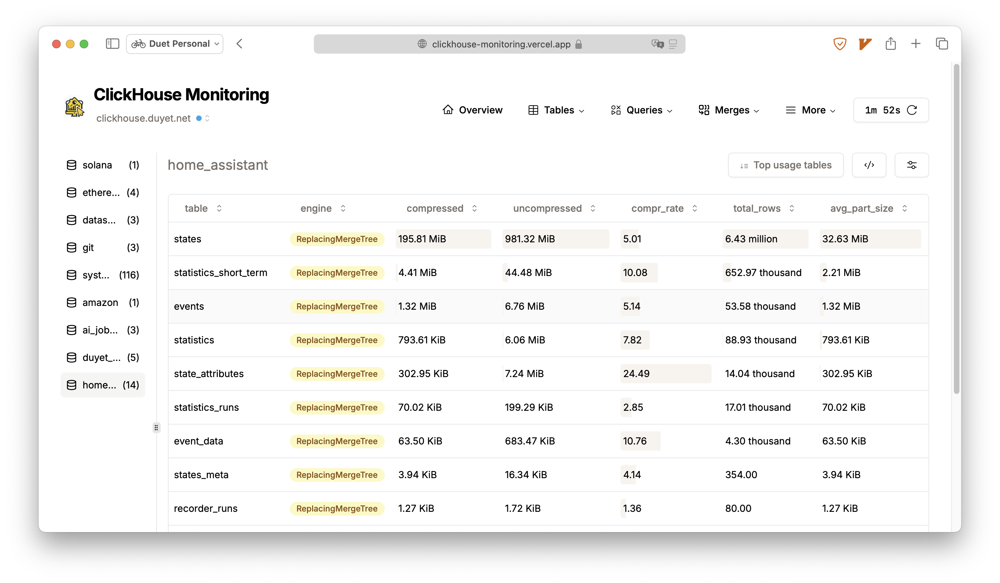
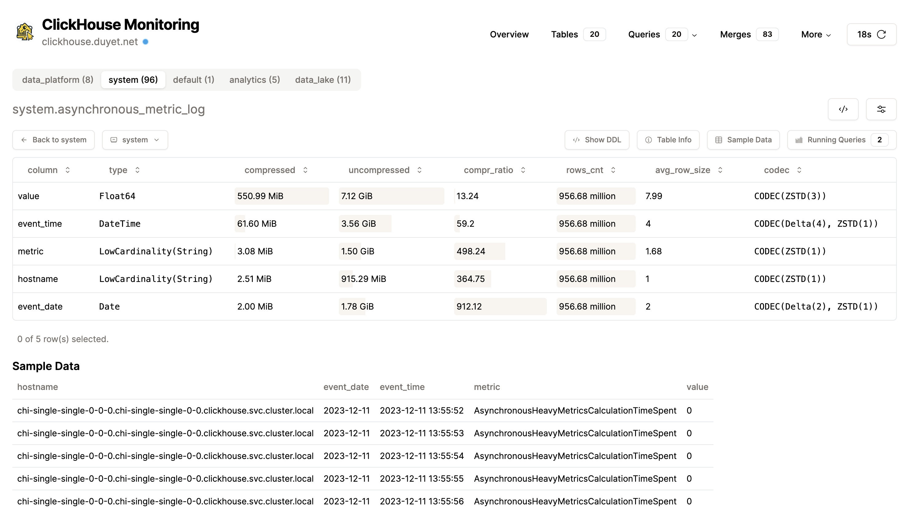
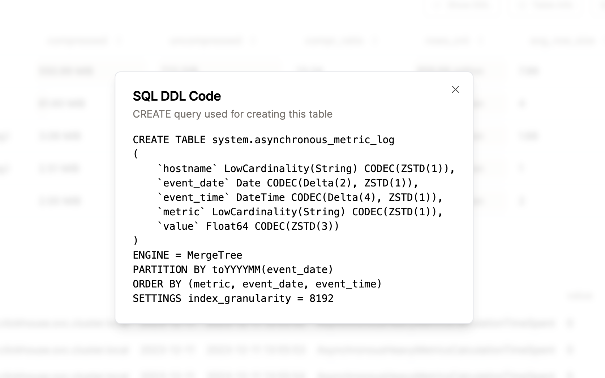
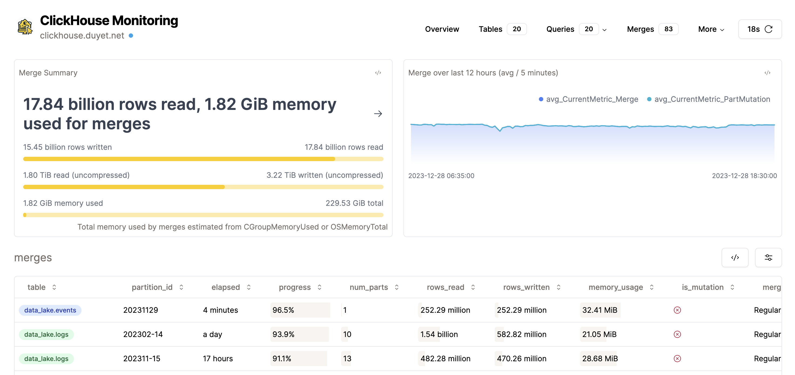
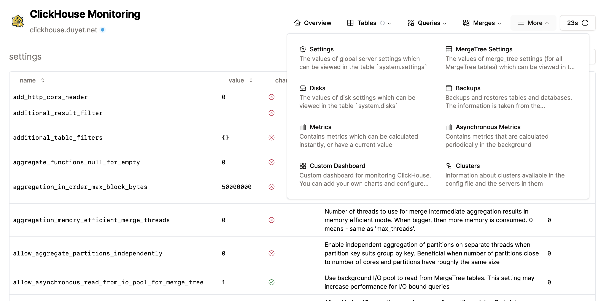
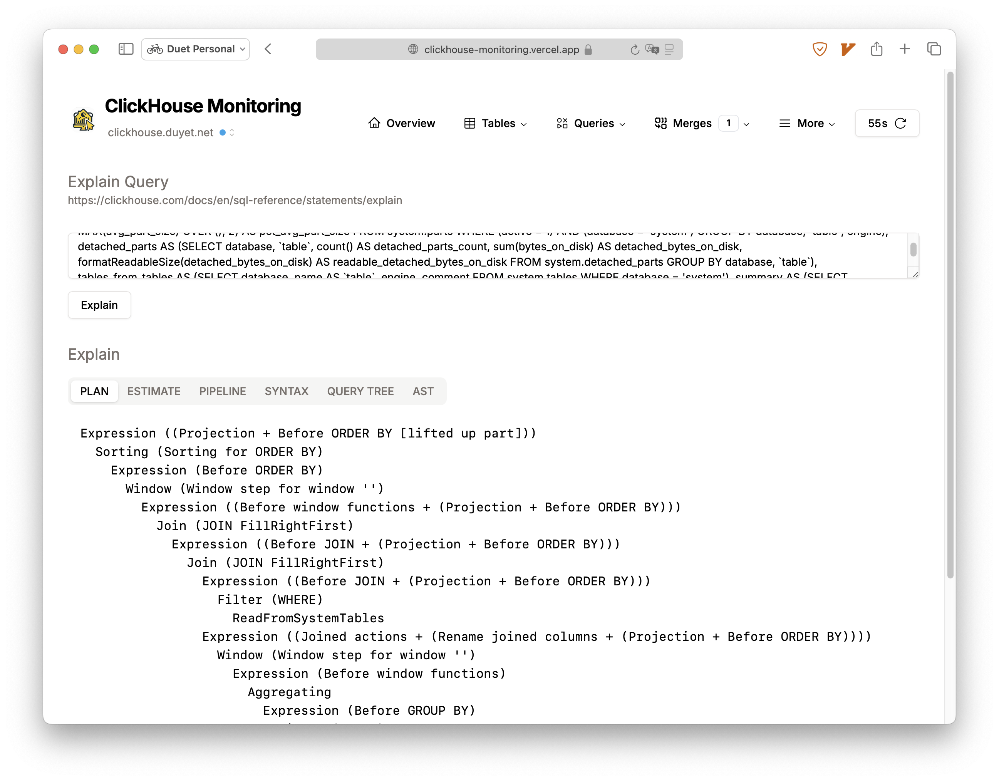
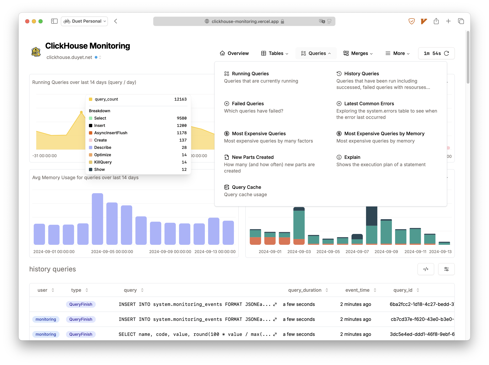
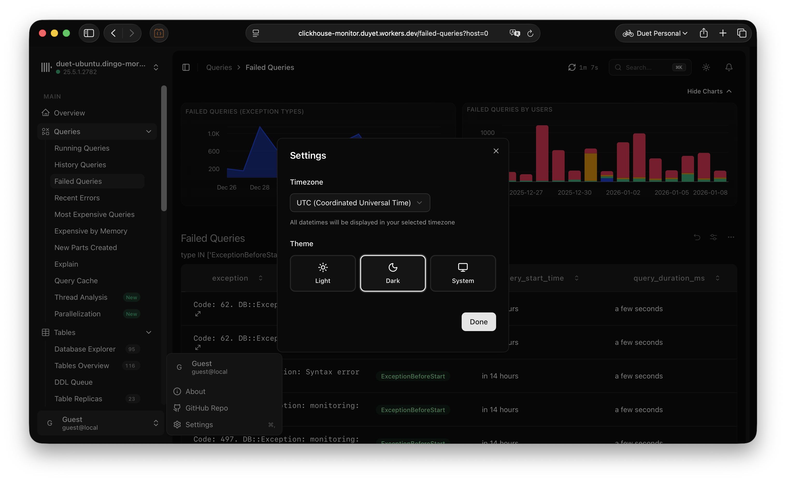
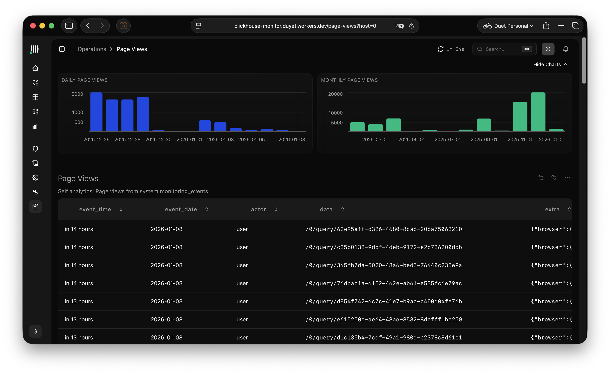
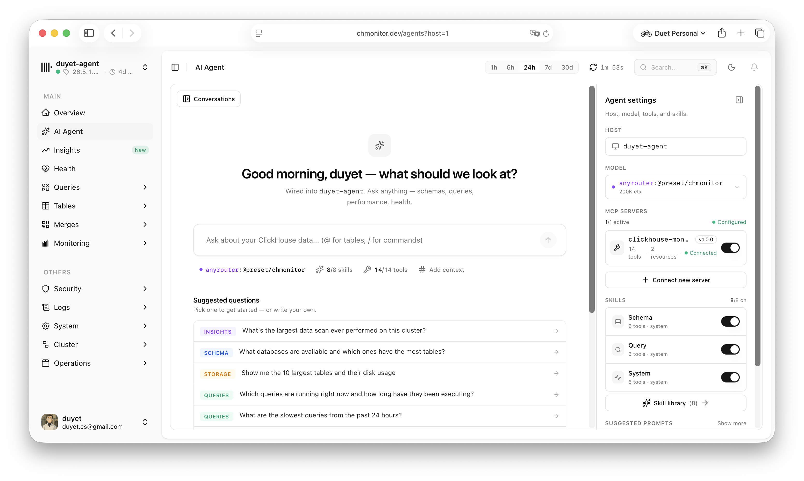
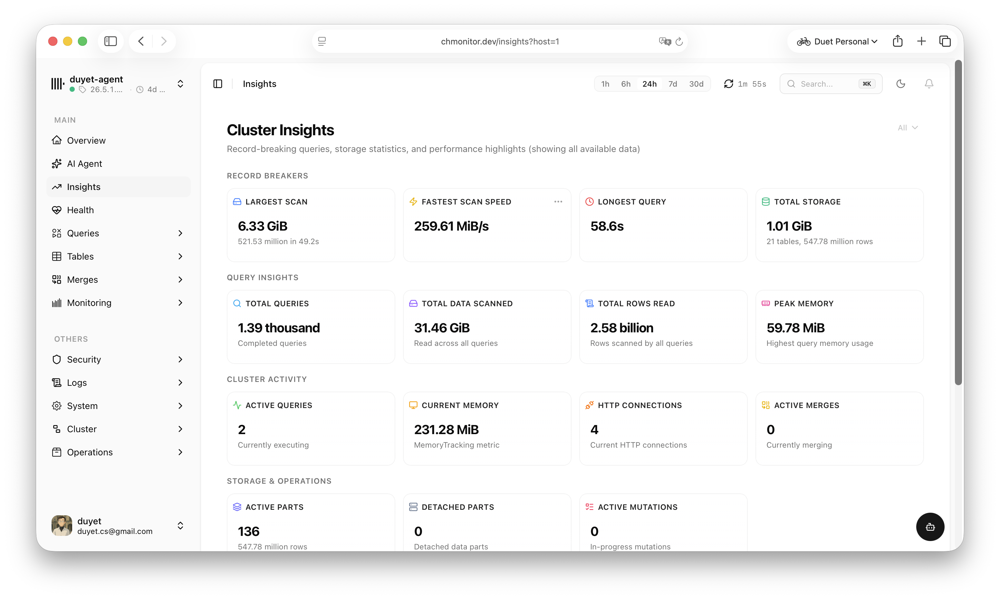
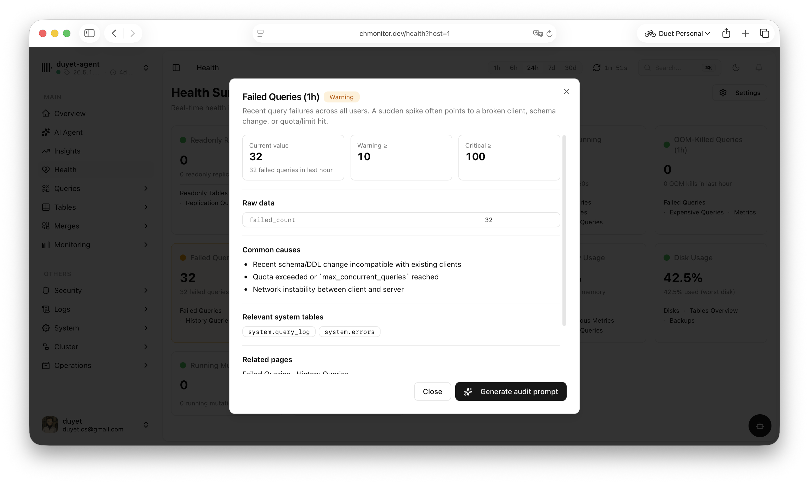
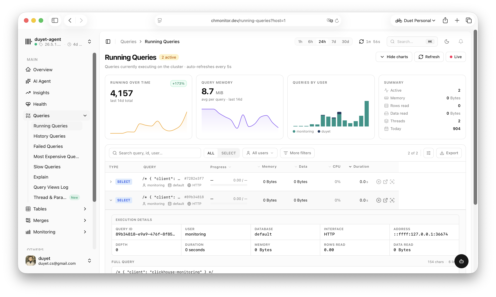

## Feedback and Contributions

Feedback and contributions are welcome! Feel free to open issues or submit pull requests.

## License

See [LICENSE](LICENSE).

---


