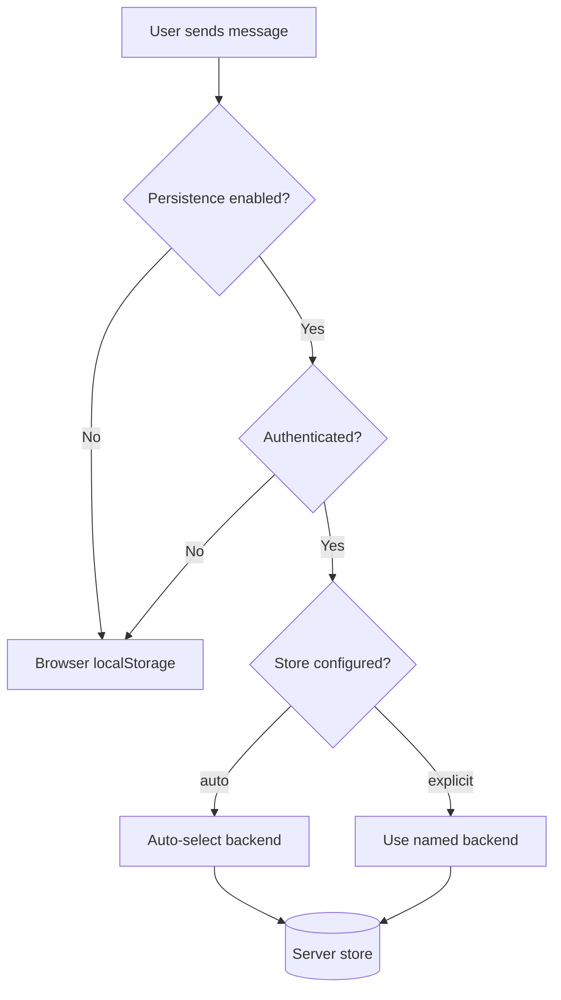
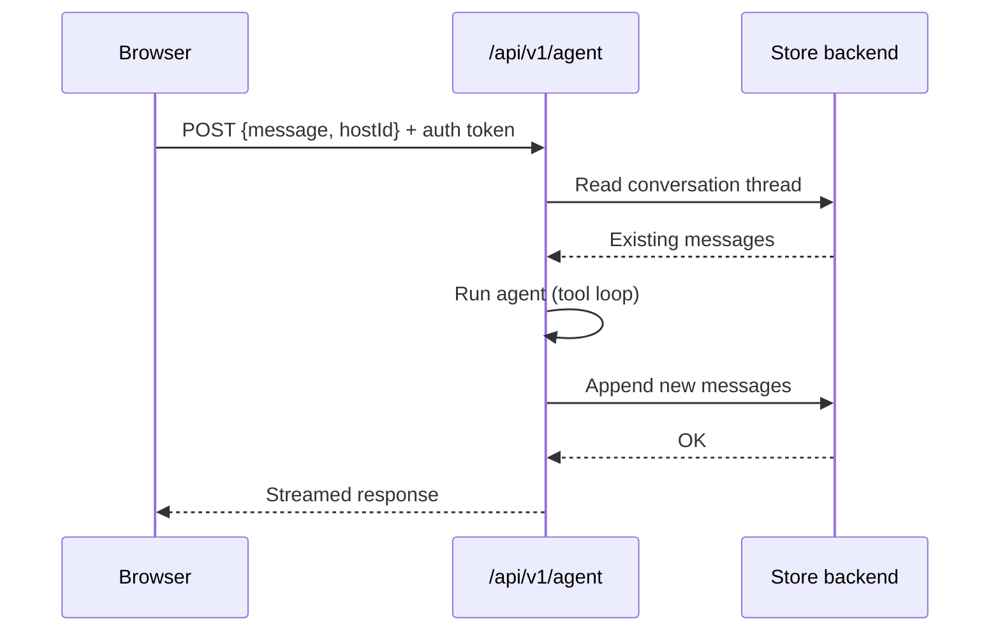

Agent chat history is stored in **browser localStorage** by default. No server setup is needed. Enable server-side persistence when you want history shared across devices, preserved after a browser clear, or visible to multiple users.

## How persistence works



- **Persistence off** — every conversation is local to the browser. Clearing browser data loses history.
- **Persistence on, unauthenticated user** — falls back to localStorage. Server stores require a user identity to scope history correctly.
- **Persistence on, authenticated user** — history is read and written to the configured server store.

## Enable server persistence

```bash
AGENT_CONVERSATION_PERSISTENCE=true
AGENT_CONVERSATION_STORE=auto   # or a specific backend
```

With `auto`, the server picks the first available backend in priority order (AgentState → D1 → Durable Object → Postgres → ClickHouse). See [Store Backends](/ai-agent/conversation-history/backends) for the full resolution order and per-backend setup.

## Request / response flow



On each request the server loads the thread from the store, runs the agent, then writes the updated thread back before streaming the response to the browser.

## Auth requirement

Server stores require an authenticated user identity to namespace threads. If the request is unauthenticated, the server skips persistence and the browser keeps local history. To enable server persistence, configure an auth provider — see [Authentication](/authentication).

## Deprecated alias

`NEXT_PUBLIC_FEATURE_CONVERSATION_DB=true` is accepted as an alias for `AGENT_CONVERSATION_PERSISTENCE=true` but is deprecated. Do not use it for new deployments.

## Next steps

- [Store Backends](/ai-agent/conversation-history/backends) — exact config for each backend with platform recommendations
