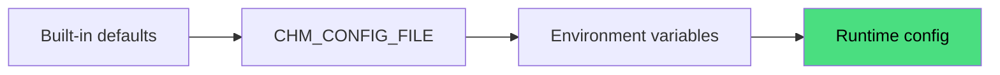

# Configuration

This page explains how chmonitor reads configuration and which category lives where. Start here, then follow the links to the detailed references.

---

## How configuration works

chmonitor has three configuration sources. A later source wins over an earlier one:

```
built-in defaults
  → CHM_CONFIG_FILE (TOML or YAML, feature permissions only)
    → environment variables
```

| Source | What it controls | Notes |
|---|---|---|
| Built-in defaults | Everything | Every feature is public and enabled. Sensible query/pool timeouts. |
| `CHM_CONFIG_FILE` | Feature permissions only | Optional file; mount at any path, point `CHM_CONFIG_FILE` at it. |
| Environment variables | All settings | Primary surface. Server vars take effect on restart; client vars require a rebuild. |
| Browser localStorage | Per-user UI state | Time range, alert settings, connection list. Not server config. |

---

## Client variable prefixes

Browser-exposed variables are **inlined at build time**. The prefix depends on which app you run:

| App | Client prefix | Example |
|---|---|---|
| `apps/dashboard` (TanStack Start, current) | `VITE_*` | `VITE_AUTH_PROVIDER` |
| Legacy Next.js (v0.2 and earlier) | `NEXT_PUBLIC_*` | `NEXT_PUBLIC_AUTH_PROVIDER` |

The variable names and values are identical — only the prefix differs. This page and the [Environment Variables](/reference/environment-variables) reference use the `VITE_*` form. If you are migrating from a v0.2 Next.js deployment, substitute `NEXT_PUBLIC_` wherever you see `VITE_`.

Changing a `VITE_*` variable requires a **rebuild and redeploy** — it is not a runtime change.

---

## Configuration categories

### ClickHouse connection

The only required settings. Set `CLICKHOUSE_HOST` at minimum.

```bash
CLICKHOUSE_HOST=http://localhost:8123
CLICKHOUSE_USER=default
CLICKHOUSE_PASSWORD=
```

For multiple hosts, use comma-separated values. See [Multiple Hosts](/advanced/multiple-hosts).

Full reference: [Environment Variables — ClickHouse Connection](/reference/environment-variables#clickhouse-connection).

---

### Query execution and connection pool

Controls timeouts, caching, and the connection pool. Defaults are sensible; override only if needed.

Key variables: `CLICKHOUSE_MAX_EXECUTION_TIME` (60 s), `CLICKHOUSE_POOL_SIZE` (10).

Full reference: [Environment Variables — Query Execution](/reference/environment-variables#query-execution).

---

### Authentication

Server auth is off by default (`CHM_AUTH_PROVIDER=none`). Choose a provider:

| Provider | Description |
|---|---|
| `none` | Open — no login required. |
| `clerk` | Clerk browser sessions. |
| `proxy` | Trust a reverse proxy (Cloudflare Access JWT or trusted header). |

An API key layer (`CHM_API_KEY_SECRET`) can run alongside any provider and issues signed `chm_` Bearer tokens for scripts and MCP clients.

Full reference: [Authentication](/authentication).

---

### Feature permissions

All features are public and enabled by default. Gate or disable features via env vars or a config file.

```bash
# Gate agent behind login
CHM_FEATURE_AGENT_ACCESS=authenticated

# Disable a feature entirely
CHM_FEATURE_METRICS_ENABLED=false

# Disable multiple features at once
CHM_DISABLED_FEATURES=settings,insights
```

Full reference: [Feature Permissions](/advanced/feature-permissions).

---

### AI Agent

The agent uses an OpenAI-compatible API. Set `LLM_API_KEY` to enable it.

```bash
LLM_API_KEY=sk-...
LLM_API_BASE=https://openrouter.ai/api/v1      # default
LLM_MODEL=openrouter:openrouter/free           # default; format is provider:modelId
```

Keep LLM keys server-side. Never use `VITE_` or `NEXT_PUBLIC_` for them.

Full reference: [AI Agent — Configuration](/ai-agent/configuration).

---

### Conversation store

Agent conversations default to browser localStorage. Enable server persistence:

```bash
# Build time (before bun run build); also requires VITE_AUTH_PROVIDER=clerk:
VITE_FEATURE_CONVERSATION_DB=true

# Runtime — force a backend (optional; auto-selects when unset):
CONVERSATION_STORE_BACKEND=agentstate   # or: d1, postgres, memory
```

Full reference: [Conversation History — Backends](/ai-agent/conversation-history/backends).

---

### Health alerting

A cron sweep runs health checks over all hosts every 5 minutes (Cloudflare Cron Trigger) and can post webhook alerts.

```bash
HEALTH_ALERT_ENABLED=true
HEALTH_ALERT_WEBHOOK_URL=https://hooks.slack.com/services/...
HEALTH_ALERT_MIN_SEVERITY=warning
```

Full reference: [Environment Variables — Health Alerting](/reference/environment-variables#health-alerting).

---

### PeerDB monitoring

Optional. Set `PEERDB_API_URL` to enable the PeerDB section in the sidebar.

Full reference: [Environment Variables — PeerDB](/reference/environment-variables#peerdb-monitoring).

---

### Branding and analytics

All client-side, all build-time. Customize the tab title, logo, and analytics integrations.

```bash
VITE_TITLE_SHORT=MyCompany CH
VITE_MEASUREMENT_ID=G-XXXXXXXXXX
```

Full reference: [Environment Variables — Analytics and Branding](/reference/environment-variables#analytics--branding).

---

## Where to set variables

| Platform | How |
|---|---|
| Docker | `-e VAR=value` flags on `docker run`, or `environment:` in `docker-compose.yml` |
| Kubernetes / Helm | `env:` in `values.yaml` or a `Secret` mounted as env |
| Cloudflare Workers | `[vars]` in `wrangler.toml`; secrets via `wrangler secret put` |
| Vercel | Project → Settings → Environment Variables |
| Self-hosted Node | `.env` file or shell export |

See the per-platform install guides for copy-paste examples.

---

## Next steps

<Cards>
<Card title="Environment Variables" href="/reference/environment-variables" description="Full list of every variable, grouped by category." />
<Card title="Feature Permissions" href="/advanced/feature-permissions" description="Config-file and env-override details." />
<Card title="Authentication" href="/authentication" description="Choose and configure an auth provider." />
<Card title="AI Agent — Configuration" href="/ai-agent/configuration" description="LLM provider setup." />
<Card title="MCP Server" href="/reference/mcp-server" description="Connect external AI tools." />
</Cards>

---

## Architecture overview

How the three configuration sources layer together at startup:



## TypeScript SDK example

The public MCP client exposes typed helpers. Hover any identifier for its type:

```ts twoslash
// @noErrors
interface ChmonitorConfig {
  host: string
  user: string
  password: string
  maxExecutionTime?: number
}

const config: ChmonitorConfig = {
  host: 'https://clickhouse.example.com:8443',
  user: 'monitoring',
  password: 'secret',
  maxExecutionTime: 60,
}

console.log(config.host)
//                 ^?
```
