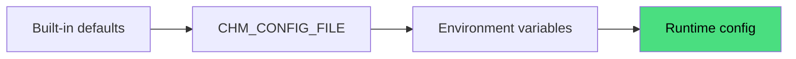

# Configuration

This page explains how chmonitor reads configuration and which category lives where. Start here, then follow the links to the detailed references.

---

## How configuration works

chmonitor has three configuration sources. A later source wins over an earlier one:

```
built-in defaults
  → CHM_CONFIG_FILE (TOML or YAML, feature permissions only)
    → environment variables
```

| Source | What it controls | Notes |
|---|---|---|
| Built-in defaults | Everything | Every feature is public and enabled. Sensible query/pool timeouts. |
| `CHM_CONFIG_FILE` | Feature permissions only | Optional file; mount at any path, point `CHM_CONFIG_FILE` at it. |
| Environment variables | All settings | Primary surface. Server vars take effect on restart; client vars require a rebuild. |
| Browser localStorage | Per-user UI state | Time range, alert settings, connection list. Not server config. |

---

## One canonical name per setting

Settings the browser needs (auth provider, cloud mode, feature flags) are inlined
into the client bundle at build time as `VITE_*` vars. You set each **once**: use
the canonical `CHM_*` name and `vite.config.ts` derives the matching `VITE_*` for
the client. For example, set `CHM_AUTH_PROVIDER` — not also `VITE_AUTH_PROVIDER`.

Precedence per var: explicit `VITE_*` → canonical `CHM_*` → legacy
`NEXT_PUBLIC_*` → built-in default. See [Environment Variables — One canonical
name per setting](/reference/environment-variables#one-canonical-name-per-setting).

A dual-surface setting is still needed at both build time (so vite inlines its
`VITE_*`) and runtime (so the server reads it), and changing it requires a
**rebuild and redeploy** — it is not a runtime-only change.

If you are migrating from a v0.2 Next.js deployment, the legacy `NEXT_PUBLIC_*`
prefix still works as a fallback.

---

## Configuration categories

### ClickHouse connection

The only required settings. Set `CLICKHOUSE_HOST` at minimum.

```bash
CLICKHOUSE_HOST=http://localhost:8123
CLICKHOUSE_USER=default
CLICKHOUSE_PASSWORD=
```

For multiple hosts, use comma-separated values. See [Multiple Hosts](/operate/advanced/multiple-hosts).

Full reference: [Environment Variables — ClickHouse Connection](/reference/environment-variables#clickhouse-connection).

---

### Query execution and connection pool

Controls timeouts, caching, and the connection pool. Defaults are sensible; override only if needed.

Key variables: `CLICKHOUSE_MAX_EXECUTION_TIME` (60 s), `CLICKHOUSE_POOL_SIZE` (10).

Full reference: [Environment Variables — Query Execution](/reference/environment-variables#query-execution).

---

### Authentication

Server auth is off by default (`CHM_AUTH_PROVIDER=none`). Choose a provider:

| Provider | Description |
|---|---|
| `none` | Open — no login required. |
| `clerk` | Clerk browser sessions. |
| `proxy` | Trust a reverse proxy (Cloudflare Access JWT or trusted header). |

An API key layer (`CHM_API_KEY_SECRET`) can run alongside any provider and issues signed `chm_` Bearer tokens for scripts and MCP clients.

Full reference: [Authentication](/operate/authentication).

---

### Feature permissions

All features are public and enabled by default. Gate or disable features via env vars or a config file.

```bash
# Gate agent behind login
CHM_FEATURE_AGENT_ACCESS=authenticated

# Disable a feature entirely
CHM_FEATURE_METRICS_ENABLED=false

# Disable multiple features at once
CHM_DISABLED_FEATURES=settings,insights
```

Full reference: [Feature Permissions](/operate/advanced/feature-permissions).

---

### AI Agent

The agent uses an OpenAI-compatible API. Set `LLM_API_KEY` to enable it.

```bash
LLM_API_KEY=sk-...
LLM_API_BASE=https://openrouter.ai/api/v1      # default
LLM_MODEL=openrouter:openrouter/free           # default; format is provider:modelId
```

Keep LLM keys server-side. Never use `VITE_` or `NEXT_PUBLIC_` for them.

Full reference: [AI Agent — Configuration](/guide/ai-agent/configuration).

---

### Conversation store

Agent conversations default to browser localStorage. Enable server persistence:

```bash
# Set the canonical name (VITE_FEATURE_CONVERSATION_DB is derived at build time);
# also requires Clerk auth (CHM_AUTH_PROVIDER=clerk):
CHM_FEATURE_CONVERSATION_DB=true

# Runtime — force a backend (optional; auto-selects when unset):
CONVERSATION_STORE_BACKEND=agentstate   # or: d1, postgres, memory
```

Full reference: [Conversation History — Backends](/guide/ai-agent/conversation-history/backends).

---

### Health alerting

A cron sweep runs health checks over all hosts every 5 minutes (Cloudflare Cron Trigger) and can post webhook alerts.

```bash
HEALTH_ALERT_ENABLED=true
HEALTH_ALERT_WEBHOOK_URL=https://hooks.slack.com/services/...
HEALTH_ALERT_MIN_SEVERITY=warning
```

Full reference: [Environment Variables — Health Alerting](/reference/environment-variables#health-alerting).

---

### PeerDB monitoring

Optional. Set `PEERDB_API_URL` to enable the PeerDB section in the sidebar.

Full reference: [Environment Variables — PeerDB](/reference/environment-variables#peerdb-monitoring).

---

### Branding and analytics

All client-side, all build-time. Customize the tab title, logo, and analytics integrations.

```bash
VITE_TITLE_SHORT=MyCompany CH
VITE_MEASUREMENT_ID=G-XXXXXXXXXX
```

Full reference: [Environment Variables — Analytics and Branding](/reference/environment-variables#analytics--branding).

---

## Where to set variables

| Platform | How |
|---|---|
| Docker | `-e VAR=value` flags on `docker run`, or `environment:` / an optional `env_file: .env` in `docker-compose.yml` |
| Kubernetes / Helm | `values.yaml` → ConfigMap (non-secret) + `Secret` (secrets), mounted via `envFrom` |
| Cloudflare Workers (your own) | Non-secret vars via `wrangler.toml [vars]`; secrets via `wrangler secret put` |
| Vercel | Project → Settings → Environment Variables |
| Self-hosted Node | `.env` / `.env.local` file or shell export (template: `apps/dashboard/.env.example`) |

<Callout type="info" title="The hosted product uses .env.cloud">
On the hosted `dash.chmonitor.dev`, `wrangler.toml` declares **no** `[vars]` — the non-secret config lives in committed `apps/dashboard/.env.cloud` (+ `.env.preview`), which feeds both the client build and the Worker runtime vars (injected by `scripts/patch-wrangler-env.ts` at deploy). When working in this repo, edit `.env.cloud` rather than re-adding a `[vars]` block.
</Callout>

See the per-platform install guides for copy-paste examples.

---

## Next steps

<Cards>
<Card title="Environment Variables" href="/reference/environment-variables" description="Full list of every variable, grouped by category." />
<Card title="Feature Permissions" href="/operate/advanced/feature-permissions" description="Config-file and env-override details." />
<Card title="Authentication" href="/operate/authentication" description="Choose and configure an auth provider." />
<Card title="AI Agent — Configuration" href="/guide/ai-agent/configuration" description="LLM provider setup." />
<Card title="MCP Server" href="/reference/mcp-server" description="Connect external AI tools." />
</Cards>

---

## Architecture overview

How the three configuration sources layer together at startup:



## TypeScript SDK example

The public MCP client exposes typed helpers. Hover any identifier for its type:

```ts twoslash
// @noErrors
interface ChmonitorConfig {
  host: string
  user: string
  password: string
  maxExecutionTime?: number
}

const config: ChmonitorConfig = {
  host: 'https://clickhouse.example.com:8443',
  user: 'monitoring',
  password: 'secret',
  maxExecutionTime: 60,
}

console.log(config.host)
//                 ^?
```
